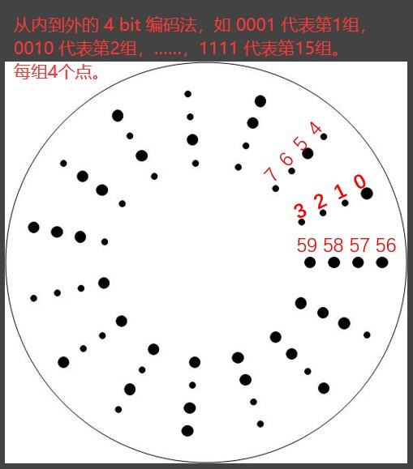

# CameraCalibration_3DReconstruction
Course Project: Exterior Parameters Calibration for Camera and 3D Reconstruction on Pair Images

# Control Points Extraction
Extracted and labelled the control points pairs in pair images automatically using canny algorithm and ellipse detection algorithm in OpenCV.
First, based on the [control point map](Rule4ControlPoint.jpg), the edge detection process is carried out to obtain the center coordinates of the circle in the map, 
which are converted to polar coordinates, so as to obtain the numbering rules on the numbering map; 

Then, the edge detection and ellipse detection are carried out on the image to locate the image-square coordinates of the control points. 

Using the numbering rules of the polar coordinates, the number of the control points on the control point map is corresponded with the control point on the image one by one. 

Here is the result of labelling:
| Original Labelling Map | Automatically Labelling Map | Automatically Labelling Image |
|--|--|--|
|  || |

# Exterior Parameters Calculation
Computed exterior parameters based on control points pairs with known 3D coordinates using 2D DLT models and Bundle Adjustment methods.
| Exterior Parameters | Right Image | Left Image |
|--|--|--|
| X |344.423| 130.802|
| Y |516.755| 605.799|
| Z |393.261| 295.366|
| Phi |-0.921| -0.455|
| Omega |-0.879| -1.122|
| kappa |2.110| 2.653|

| Dimention | General Precision |
|--|--|
| X |0.0084|
| Y |0.0287|
| Z |0.0125|

# SIFT for Image Matching
Applied SIFT algorithm for detecting corresponding points. Employed exterior parameters for depth estimation for both corresponding points pair and control points, and evaluated the precision.
Result of SIFT:

